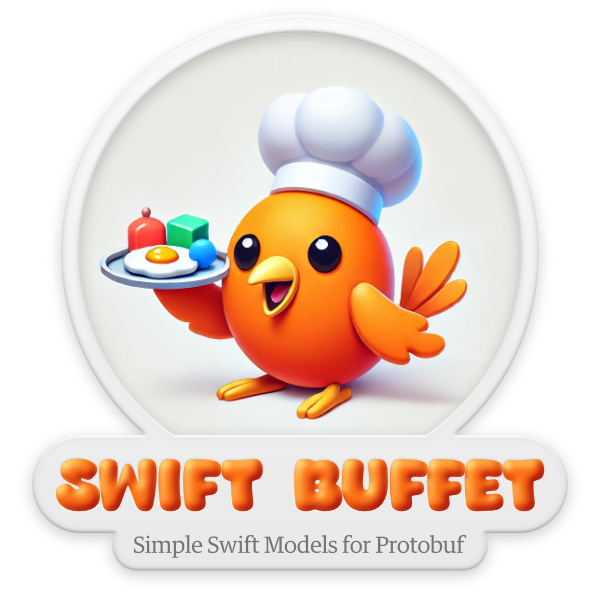

<p align="center">
  
</p>

Swift Buffet's goal is to generate simple Swift structs from Protocol Buffer (`.proto`) files. These simple types can then be used more easily with your existing swift code. This tool can be used both as a command-line tool and as a Swift Package Manager plugin.

## Installation

### Swift Package Manager

To integrate Swift Buffet into your project, add the following to your `Package.swift` file:

```swift
dependencies: [
    .package(url: "https://github.com/guardian/swift-buffet.git", from: "1.0.0")
]
```

### As a Plugin

To use Swift Buffet as a plugin, include it in your target's `plugins` array in `Package.swift`:

```swift
targets: [
    .target(
        name: "YourTarget",
        resources: [
            .process("yourFile.proto")
        ],
        plugins: [
            .plugin(name: "SwiftBuffetPlugin", package: "SwiftBuffet"))
        ]
    )
]
```

## Usage

### Command-line Tool

To generate Swift files from a `.proto` file using Swift Buffet, run the following command:

```bash
swift run SwiftBuffet path/to/your/file.proto path/to/your/output.swift
```

This will parse the specified `.proto` file and generate a corresponding `.swift` file. By default, Swift Buffet will generate structs based on the protocol buffer messages and enums found in the input file.

#### Options and Flags

In addition to the basic input and output paths, Swift Buffet provides several options and flags that give you greater control over the generated Swift code:

- `--swift-prefix`: Use this option to specify a prefix for all Swift objects generated by the tool. For example:

  ```bash
  swift run SwiftBuffet path/to/your/file.proto path/to/your/output.swift --swift-prefix MyPrefix
  ```

  This will prefix all generated types with `MyPrefix`.

  ```swift
  public struct MyPrefixPerson: Hashable, Equatable, Sendable {
    ...
  }
  ```

- `--include-protobuf`: If you need initializers that can directly convert from protobuf objects, use this option:

  ```bash
  swift run SwiftBuffet path/to/your/file.proto path/to/your/output.swift --include-protobuf
  ```

  This can be useful when you need to interoperate between raw protobuf objects and the generated Swift structs.
  ```swift
  public struct Person: Hashable, Equatable, Sendable {
    ...
    public init(proto: ProtoPerson)? {
      ...
    }
    public init?(data: Data) {
      ...
    }
  }
  ```

- `--proto-prefix`: This option allows you to specify a prefix for the protobuf objects in the generated code. By default, this is set to `Proto`. You can customize it like this:

  ```bash
  swift run SwiftBuffet path/to/your/file.proto path/to/your/output.swift --proto-prefix MyProto
  ```

  The protobuf objects in the generated Swift code will be prefixed with `MyProto`.

- `--store-backing-data`: When this option is enabled, the generated Swift structs will retain the original data from the protobuf objects. This is useful for debugging or serialization purposes:

  ```bash
  swift run SwiftBuffet path/to/your/file.proto path/to/your/output.swift --store-backing-data
  ```
  This gives you a property that will store the data used to initialise the struct.
  ```swift
  public struct Person: Hashable, Equatable, Sendable {
    ...
    public private(set) var _backingData: Data?
    ...
    public init?(data: Data) {
      ...
      self._backingData = data
    }
  }
  ```

- `--use-local-ids`: This option is enabled by default and adds local IDs to the generated Swift objects, which can be particularly helpful in SwiftUI-based apps. To disable this feature:

  ```bash
  swift run SwiftBuffet path/to/your/file.proto path/to/your/output.swift --use-local-ids false
  ```

  ```swift
  public struct Person: Hashable, Equatable, Sendable {
    ...
    public private(set) var _localID = UUID()
    ...
  }
  ```

#### Logging

You can control the verbosity of the output using the following flags:

- `-v` / `--verbose`: Enable verbose logging. This is useful if you want to see detailed information about the parsing and generation process.

  ```bash
  swift run SwiftBuffet path/to/your/file.proto path/to/your/output.swift --verbose
  ```

- `-q` / `--quiet`: Suppress most logging output. Only critical messages will be shown.

  ```bash
  swift run SwiftBuffet path/to/your/file.proto path/to/your/output.swift --quiet
  ```

#### Example

For example, to generate Swift code from `myFile.proto`, with a Swift object prefix of `MyApp`, and also include protobuf initializers, you would run:

```bash
swift run SwiftBuffet myFile.proto MyAppModels.swift --swift-prefix MyApp --include-protobuf
```

---

## Contributing

Contributions are welcome! Please open an issue or submit a pull request.

## Acknowledgements

- [Protocol Buffers](https://developers.google.com/protocol-buffers)
- [Swift Package Manager](https://swift.org/package-manager/)

---
